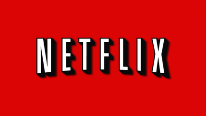
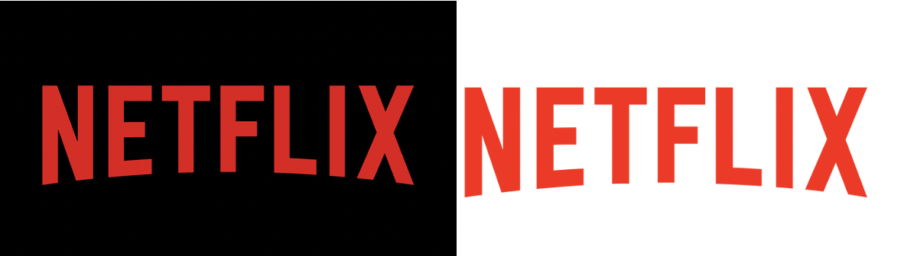

**Netflix** is a very recognisable platform, where members can watch TV shows and movies instantly in over **190 countries**. The company was established in august 1997 in the United States. Throughout the years the typography used by the company has changed, in fact, as the audience was changing, the typography was modified accordingly.

The original logo was designed as **block letters**, all capitals on a **red background**. The text is rather **rigid** and **emphatic**, there is **no contrast** in thickness in the letters, and **no serifs**. This logo might seem very simple, but there are other elements added that make this typography so effective. The letters were **arched** to look like the curve of an old projector. This was implemented by the **black shadowing** behind the white letters. The combination between these elements made the Netflix title look like a projected movie on a screen. The red background was a brilliant choice of colour, it was the same deep red as theatre curtains, the type of curtains they used at old movies screenings, musicals, plays, it is also the same red they use for red carpets. Impossible not to think of Hollywood! At the time, this logo gave people a nostalgia of the old movies they loved and attracted them into wanting to watch more.

In the more recent years, Netflix has changed its typography choices to represent the brand. They are no longer a movie renting business; they are now a movie and show streaming company, also working on **producing their own content** for their platform. Their **demographic has shifted** from an older generation drawn to old films nostalgia, to younger people more aware of technology and who like having everything streamlined. Netflix knows teens and young adults are all about ‘Netflix and chill’, and as a consequence, they are adapting their brand’s image. In the newer version of the logo, the letters are now in the Hollywood red, while the background varies between black and white depening on where it is placed. The Hollywood reference is kept with the arched letters. However, the shadows were taken away for a sharper look to the letters, they are also slightly less condensed than in the original version. This fresher look has an increased simplicity making it easily marketable, it now fits the broad range of content Netflix produces, from ‘Enola Holmes’ to ‘Another life’. This new choice of typography also adds credibility to their brand as a show and movie creator, the title looks more like a network or production company rather than a simple movie distributor.

Netflix designers know what they are doing. They are more than aware they are successfully addictive, especially in the young masses, and they have no shame in using it for marketing purposes. Netflix know who they are, they know who they are selling to, and they know how to convey their company’s image in order to sell well and efficiently.

#### References

Marceau Stephanie, Netflix Analysis. Available at: <https://wra360netflix.weebly.com/introduction.html> \[Accessed on 3 October 2020] 

Netflix brand assets. Available at: <https://brand.netflix.com/en/assets/> \[Accessed on 3 October 2020]