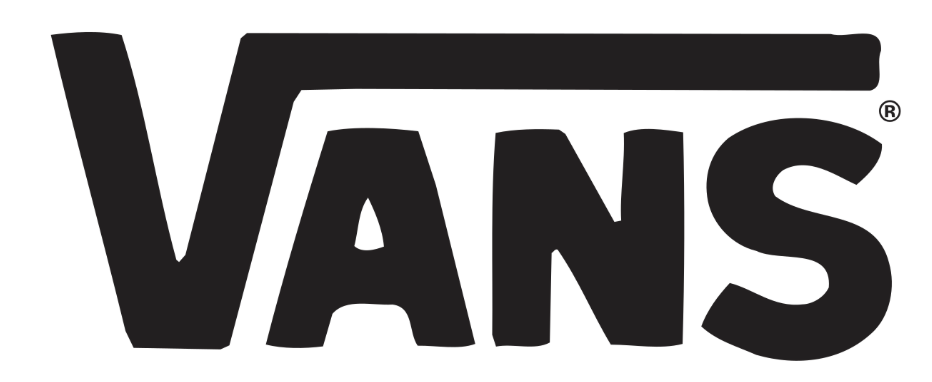
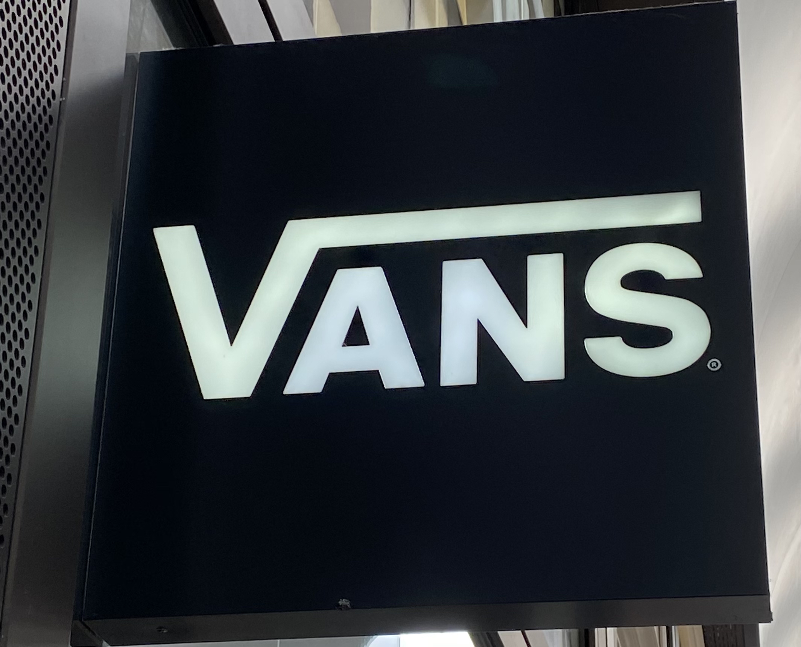

A must have in millennials wardrobes, **Vans** shoes are probably the most famous skateboarding footwear brand. Nowadays, the rubber soled shoes are no longer specifically used by skaters but by anyone seeking a casual look. The brand’s typeface is very recognisable, but what is it that really makes it easily identifiable?

Vans was created in 1966 by the Van Doran Bothers and two other partners. The company was first called ‘The Van Doren Rubber Company’. The ‘Vans’ as we know today came soon after, as an easier version of the name. The first version of the logo was surprisingly created by a 13 year old boy, Mark Van Doren, a relative of the company founders. It had slight curves but was very similar to the typography the brand uses nowadays. 

The font used by the company is a **modified version** of the world’s favourite ‘**Helvetica**’ that was created in the middle of the 20th century. The lettering is **solid**, **bold**, and **all caps**. In fact, the typography itself was quite generic at the start. The element that made the difference was the unusually stretched ‘V’. The ‘V’ is taller than the rest of the name and the top right end of the letter was extended, almost in a long serif over the rest of the letters ‘ans’. The shape it creates resembles a very simple **skating park**, it also recalls the trajectory a skater would follow when they first dive into their figures. This is very visually efficient as it emphasise on the purpose of the shoes made for skaters. This design is later used when the ‘**Old School**’ model is created, the striped shoe. The association of the line in the brand name and the shoe became even stronger and hard to forget, even seen from far away one would know these stripped shoes are Vans.

The use of **Helvetica** is often considered as the **obvious choice**. But this font has been developed to be a clearer, more legible and simpler font, goals that have been successfully met. For that reason, many companies use this font with slight **modifications**, like Vans did. The typography is **simple**, but **efficient**, it is easy to read and **recognisable**. Making it bolder and using all caps gives a solidity a skating shoe (and the rubber the company was first specialised in) is expected to have. The publicity around the shoe was made emphasising on how well the rubbered soled shoes stick to the skateboard. The **balance** and **simplicity** of the typography reflects that feature very well, all the **lines are straight**, and the **base is flat and aligned**, just like the shoe is expected to be on the skateboard.

At the very beginning of the company, the lettering was coloured in blue. But they soon adopted a **black and white** pallet, giving birth to the most famous ‘Vans’ lettering we know.

However, in 2016, they added a more **eye-catching red** to their pallet, which they use for the ‘Vans’ lettering, but they did keep the black and white for the rest of their writings, including for the ‘Off the Wall’ they have added underneath ‘Vans’ on their logo. This design is well spread accross their different advertising campains, it became the new image of the brand.

The combination between the ‘V’ feature and the all caps letters are the main elements contributing to the fact that anyone would recognize the brand if they see it written somewhere. The simplicity of colours and font makes the typography to be legible and easily recognised making. **Sometimes betting on simplicity might be safe but very efficient nevertheless.**