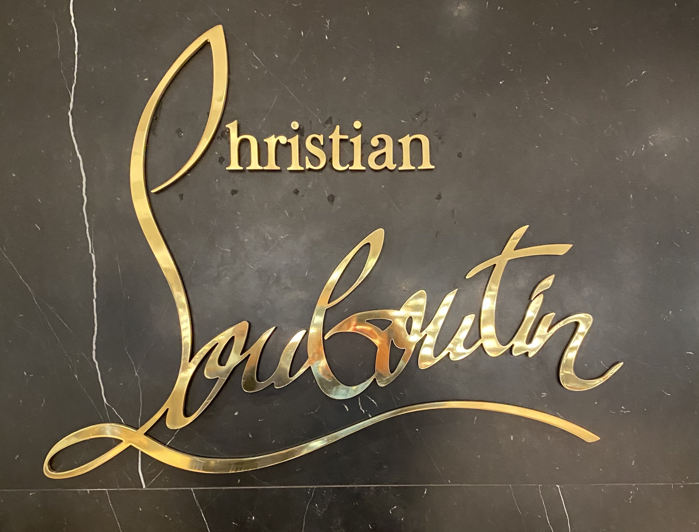
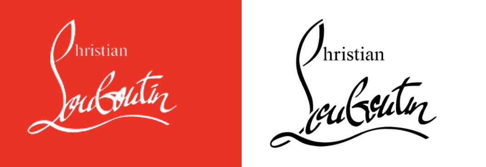

Louboutin shoes are very well known for their **red soles** and are reputable for being very **fashionable** and **luxurious** shoes. Socialites like the Kardashians, singers like Beyonce and Jennifer Lopez have all been seen wearing Louboutin’s. Heels are present in almost every woman’s wardrobe but also take place in various popular myths and fairy tales like Cinderella and the Wizard of Oz. If one is asked to cite a famous high heel brand, there is a very high probability their answer will be: **Louboutin**.

In terms of typography the brand uses two different fonts. The ‘Louboutin’ part of the writing is in a curling, handwriting looking, and the ‘L’ is much taller than the rest of the letters. The use of a **handwritten font** gives an authenticity to the brand, it looks like Christian himself has signed by hand. This part of the writing also gives the feeling the shoes are handmade, hence they are expensive and worth the price. The top end of the ‘L’ curls up to make the ‘C’ for the ‘Christian’ part of the name. The remaining ‘hristian’ letters are written in a basic **Roman font**. This font has serifs which gives an elegance to the typography, reflecting very well the elegance of the shoes and the brand itself. The combination between a handwritten lettering and a classic Roman font works very well to convey both style and strength.

The typography has another plus to it, it is **not symmetric**, a feature created to ensure the logo will never look boring. But the elongated ‘L’ has a horizontal flourish that keeps the composition from looking off balanced. The shape it creates mimics the perfect asymmetry of a pair of high heels.

Nowadays the most common version of the Christian Louboutin writing is white on a background of the **iconic red**. However, at its origin, the brand’s typography was simply black on a white background. It was in 1993, when he became famous for the red-soled shoes, that the designer decided to add red to the typography. The origin of this red is very epic, in fact, one day, while Christian was trying to find the missing element to make his shoes stand out, he saw his assistant painting her nails, he grabbed the **nail polish** and started painting the soles of a prototype shoe. 

Louboutin shoes, specially heels and their red soles became a **status symbol** people desire, when they see someone wearing a pair of heels with red soles, they know what they are, and they know what they cost.

###### References

Croasdale Joshua, FBI website. Available at: <https://fashionindustrybroadcast.com/2020/07/19/christian-louboutin-mystery-of-the-high-heel-fib-designer-fashion-guides/> \[Accessed on 30 September 2020]

O'Donnell Tanya, Logo Real website. Available at: <http://logorealm.com/christian-louboutin-logo/> \[Accessed on 1 October 2020]