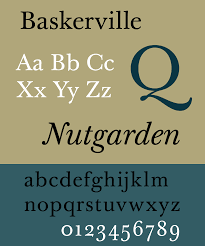
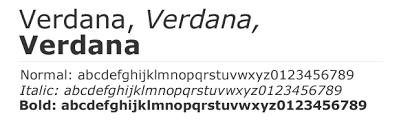

Typography is used **everywhere** in many different ways, we see it from the moment we wake up to the time we go to bed. Most of the time we do not even notice it and its **styles**, but typography is an essential element of everyday life. However, whether it is in **print or on screen**, fonts and typefaces are processed and used differently.

### Type for Print

**Serif fonts** have a long history, they were the first typefaces used, after the Gutenberg Press was invented. The serif is essentially the stroke given to the end of the main vertical and horizontal lines of a letter, characters without this feature are called ‘sans-serif’. Generally, serif fonts allow for a more **comfortable reading** at length, in fact, the serifs guide the eye smoothly form character to character, which makes serif fonts ideal for long form printed content.

The designer John Baskerville even created his own high contrast serif typeface the ‘Baskerville’. As a perfectionist he wanted a typeface that was absolutely pleasant to read, but it has so much detail that it makes it unsuitable for low resolution mediums, which makes it very illegible on certain screens. 

Times New Roman is a neutral typeface many claim to be neutrally apathetic. Matthew Butterick writes “Times New Roman is not a font of choice as the absence of a font choice, like the blackness of deep space is not a colour”. The font was widely used by newspapers, as it was created to be narrower and allow more words to fit on a line, to achieve this, the x-height was increased, and the tracking reduced. It was a legible and economical font for newspapers, making it ideal for print issues.

### Type for Screen

The use of serif fonts was widespread in the 19th century with advertising. The industry needed fonts that could be seen from a far distance, make an **impact** on the viewer, and be different from whatever random information they could have read.

As media and digitalisation boomed there was a need for typefaces that could be read easily on screen, especially with the first technologies where everything was **pixelized**. For that reason, sans-serif fonts were ideal, they could be built of pixels, and remain legible, as they were mostly straight lines.

Some sans-serif typefaces like ‘Verdana’ (designed in the 90s by Matthew Carter for Microsoft) were designed specifically for the screen. Striving for clarity, Verdana has large x-heigh for increased legibility. Despite being designed for screen, Verdana is a humanist sans-serif. This font is very effective in low-resolution devices.

As screens increased in resolution the pixel matter was less of an issue. However, san-serif fonts remain a good option for screen content, specially headings and bigger text. Sans-serifs fonts usually have a low contrast, meaning the thickness of the lines are constant with different characters. This allows the reader to distinguish more easily between characters. They are considered to be harder to read in print, as they look more like blocks and don’t have the serifs allowing for flow. So, nowadays, they are most often used for short text components, in which they are very effective.

### What type should you choose

When producing content destined to be printed, serif fonts like ‘Georgia’ or ‘Baskerville’ are a good choice. The serifs allow a flowing read, especially in larger body texts, and the higher the contrast the more sophisticated the printed text will look.

Nowadays most devices have high resolution screens which means serif fonts can be used. However, sans-serifs are preferable for headings, captions, or any piece of short text. It is also very important to consider each typeface’s features. If using a serif font for screen, an increased x-heigh, rounded numerals, and lower contrast allow for better legibility.