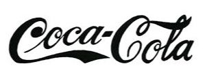
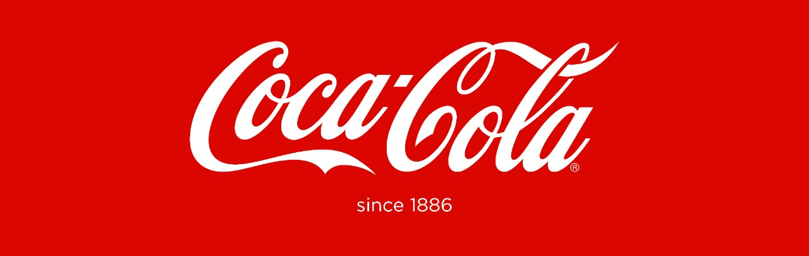
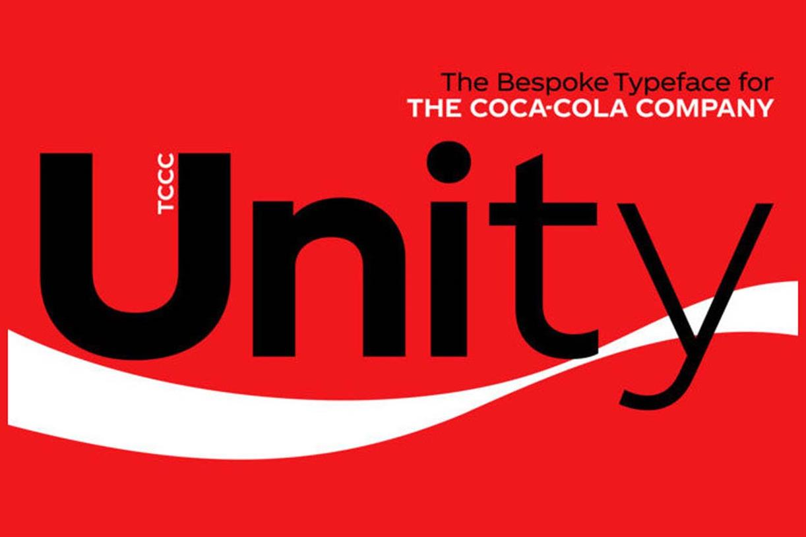
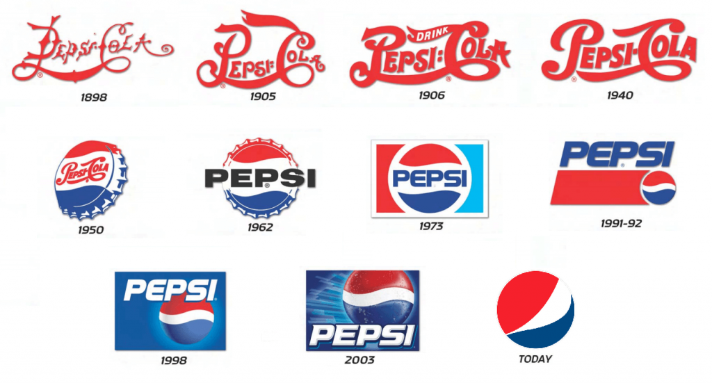

**Coca-Cola and Pepsi**: the ultimate dilemma. Some would even refuse to drink the competitor of their favourite brand of cola soda. Whether one tastes better than the other, I am not sure although I do have a personal favourite. But the question today is how different do they LOOK? So similar, yet so different. 

#### Coca-Cola

Coca-Cola is a very recognisable brand all around the world and it has been like that since over **130 years**. And in these 130 years the brand design has undergone some changes. Dr Pemberton was the one to create the formula of the drink, however, it was his bookkeeper, Frank Robinson, who had the idea to call it ‘Coca-Cola’; he thought the two Cs would work well for advertising. It was also Robinson who designed the very famous Coca-Cola script. 

The Coca-Cola script is one of the most recognisable trademarks in the world. In 1987 when it was inserted it was very ‘of the moment’. Robinson experimented with Spencerian script, the version he came up with was drawn in a flowing handwriting. The C in ‘Coca’ was extended at the bottom in a tail, almost reaching the C of ‘Cola’. That extra line gave a base for the remaining ‘oca’ letters to sit, making them to be slightly higher than the ‘Cola’ part of the name. There is very high contrast in the letters, caused by the handwriting recalling to calligraphy. This typeface is very humanised, which gives the brand an identity of product of the people to the people. Throughout the years some refining has been brought to the original version but nothing that made the brand name unrecognisable. The only major difference was the addition of the iconic Coca-Cola red, in exchange from the original black; this added to the impact the brand already had.

In 2018, Coca-Cola’s in-house design team along with Brody Associates designed their first own-brand typeface. It is called **TCCC Unity**, named after The Coca-Cola Company. It was inspired by the modernist American typography movement in the late 19th and early 20th centuries. The company says: ‘Its geometric flair and circularity look to mirror designs from Coca-Cola’s visual archive, such as its logo, packaging and advertising campaigns.’ The typeface is a sans-serif with no contrast of thickness. The forms and flicks are softer than a conventional sans-serif block typeface, this allows to accentuate the human hand in Coca-Cola’s personality: ‘Uplifting, positive moments’. It is a very versatile typeface that can work very well among different platforms, in print as well as digital. Regular weights are used for body text and headlines, whereas condensed weights are used for information text. This new typeface ought to bring the brand consistency across all media. 

#### Pepsi

The first Pepsi logo was designed in 1903, by the owner Caleb Bradham. It was a very fantasy-like hand-written font with the letters P and C of ‘Pepsi-Cola’ linked together, all in a bright red colour. In 1906, the font used was slightly cleaned up, there were less details and some of the fantasy aspects were taken away. In the early 40s, the CEO of Pepsi felt a need to stand out from Coca-Cola, so blue was added to the mix, the logo became the name ‘Pepsi-Cola’ between two blocks of colours, red at the top, blue at the bottom. This composition was printed onto bottle caps, making it even more recognisable. In, 1962, Pepsi introduced a new look to the brand; instead of the hand-written organic font, they now used a sans-serif, emphatic, rigid font, now written in black. Dropping the bright red and taking away the ‘Cola’ part of the name allowed the brand to get away from being associated with the competition. 

In 1973, the design from the bottle cap was adapted and the circle was introduced to the company logo, making it very similar to the one we are familiar with nowadays. 

#### Final Thoughts 

Both brands have undergone major changes in their aesthetics since they were first created. Pepsi has for a long been compared to Coca-Cola as an under brand or a cheap copied version, so designers have made a great effort into creating a completely new look to the brand in order for it to be fresh and different. And they have succeeded, nowadays, Pepsi is a Cola drink just like Coca-Cola. On the other hand, Coca-Cola stood strong with almost the same design for 130 years, but in the last couple years they have created a new typeface that oddly looks like the font Pepsi uses. **Would Coca-Cola be trying to look like Pepsi?** 

#### References

McLaughlin Aimée, 2018. Design Week. Available at: <https://www.designweek.co.uk/issues/8-14-january-2018/coca-cola-unveils-first-brand-typeface-130-year-history/>

McWade John, 2009. Before and After’s. Available at: <https://en.wikipedia.org/wiki/Pepsi_Globe>

Rogoza Roman, 2020. Logaster. Available at: <https://www.logaster.com/blog/pepsi-logo/>

Unknown, 2018. Coca-Cola Australia. Available at: <https://www.coca-colacompany.com/au/news/trace-the-130-year-evolution-of-the-coca-cola-logo>

Woodhouse Luke, 2018. Campaign Live. Available at: <https://www.campaignlive.co.uk/article/130-years-coca-cola-typeface-deserves/1454619>