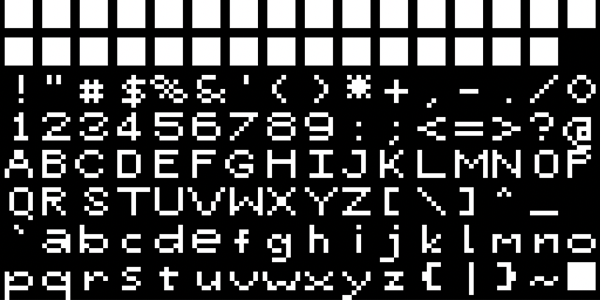
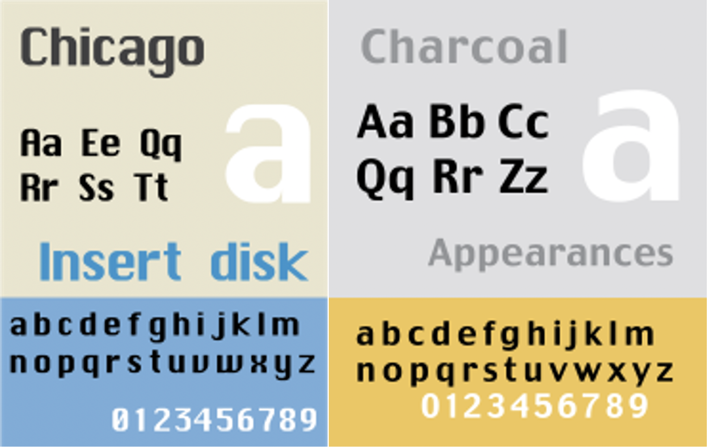
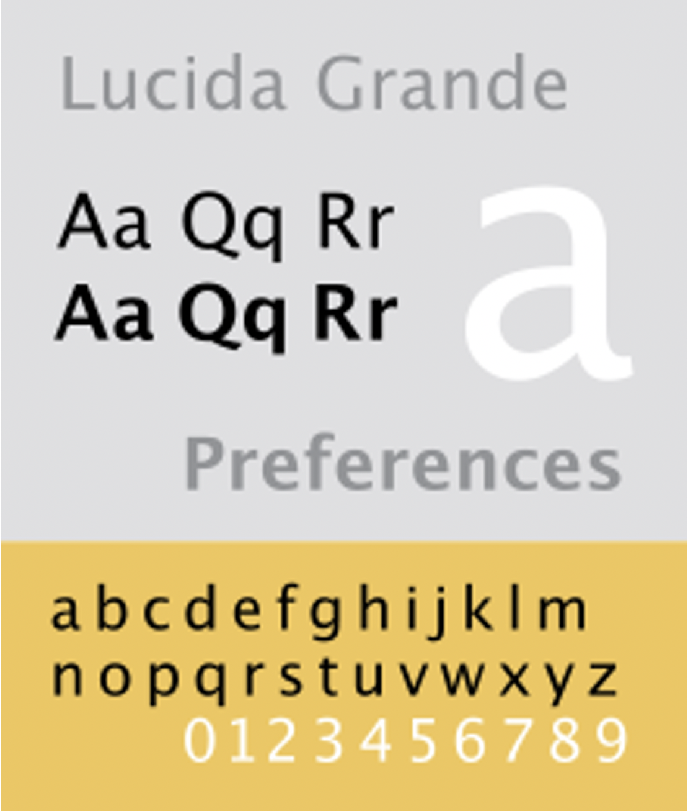
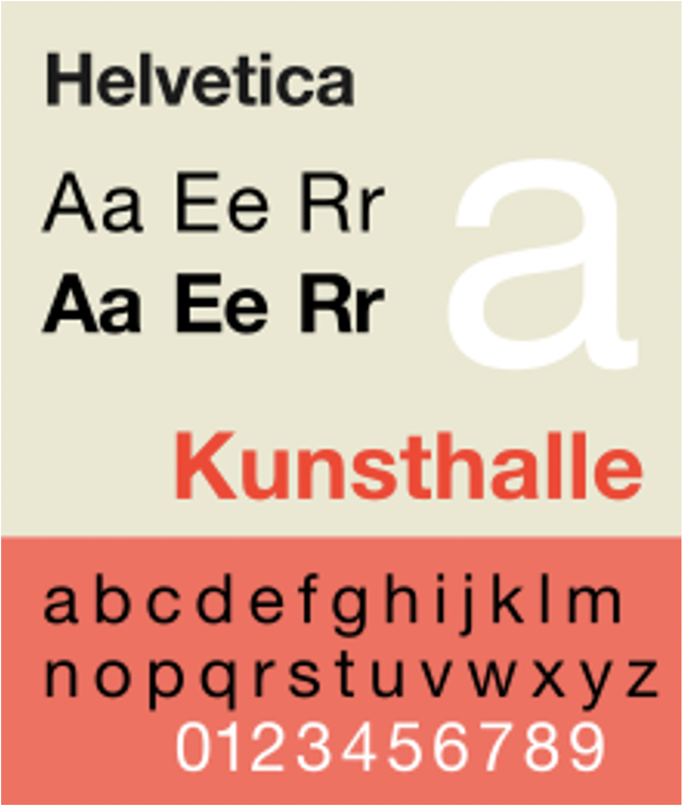
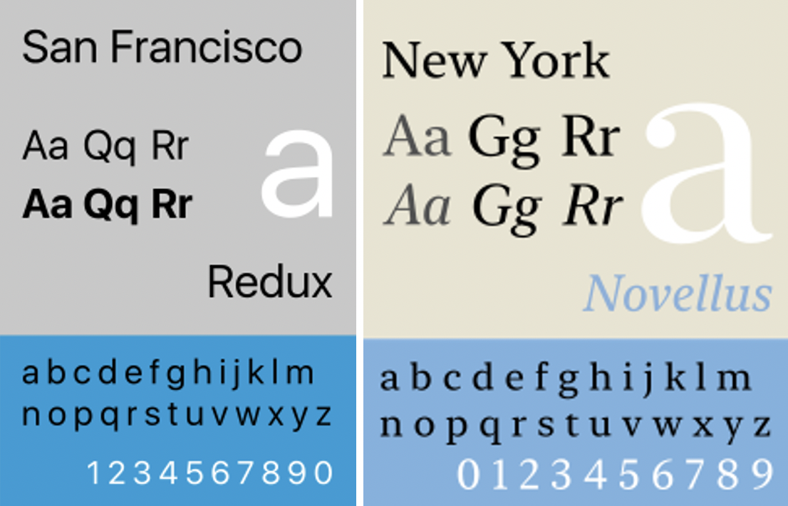

**Apple**, the corporate giant. Apple is probably one of the most well-known companies in the world. iPhone, iPod, iPad, MacBook, they are everywhere! But we rarely think about the fonts and typefaces they use for their devices and the science behind it. Let’s have a look at the different typefaces Apple has used since its creation, and why they changed so many times. 

As explained in a previous article ([Screen or Print?](https://behind-the-type.netlify.app/2020/10/11/font-analysis/)) early computers had very limited graphical performances, hence the use of sans-serif fonts. Apple’s first computers did not escape the trend, and the only font they could display at the time was only **uppercase ASCII**, a very rudimentary pixelized font.

In 1984, when the Macintosh was introduced, it used another pixel font (also called a bitmap font), **Chicago**. It had a very digital look, considerably condensed, and it had a slight contrast to it. Whereas in 1997, with the arrival of Mac OS 8, the **Charcoal** font was introduced, it was designed to be more l legible than Chicago, but keeping the same metrics in order to be compatible with existing application software.

In 2000, **Lucida Grande** was the system font used in Mac OS X. It is a humanistic font, with very little contrast and has considerably thin lines in the regular weight. It was designed for screen so it is a very legible font.

In 2007, the 1st gen iPhone came out. Apple decided to use the famous **Helvetica** for the software design (iOS) in its iconic device. Helvetica is known to be a favourite for its legibility on screen. iOS was also used for the iPod touch, the iPad, and the Apple TV, so Helvetica was present on all these devices too. 

In 2010, as screen improved in resolution, Apple began using **Helvetica Neue** in conjunction with the iPhone 4. In fact, for devices with Retina Display, this thinner version of Helvetica worked well on the higher resolution screen, while Apple kept using Helvetica on non-Retina devices. Around 2012, Helvetica was also used in macOS applications. iTunes, iMovie, iPhoto and GarageBand were applications featuring Helvetica, however the rest of macOS software retained the use of Lucida Grande, which was especially made for screen and is more legible. 

In 2014, Apple released their own brand designed typeface, the **San Francisco**.  It is a non-grotesque font, with no contrast and metrics very similar to Helvetica, as it was inspired by it. Replacing Helvetica, it is now the widely used font for Apple devices and software. It has different variants in order to fit best with the different devices. The most different version is SF Compact, used in the Apple Watch, in this font, the sides of round letters like ‘o’, ‘e’ and ‘s’ are flat, and the space between letters is smaller, more suitable for a font being displayed on a small screen like on the Apple Watch. In 2019, a serif counterpart to San Francisco was released, the **New York**. It is exclusively used for Apple Books. There is more contrast than in San Francisco and the serifs allow for more flow and readability. 

Throughout the years Apple has made various changes to the typefaces and fonts used in their operating systems. We might think some of these changes were very minimal, but they all had a **purpose.** All their systems look very **clean, professional and functional**. We now know Apple uses typeface in a very clever way for their systems to look and operate in the best way.