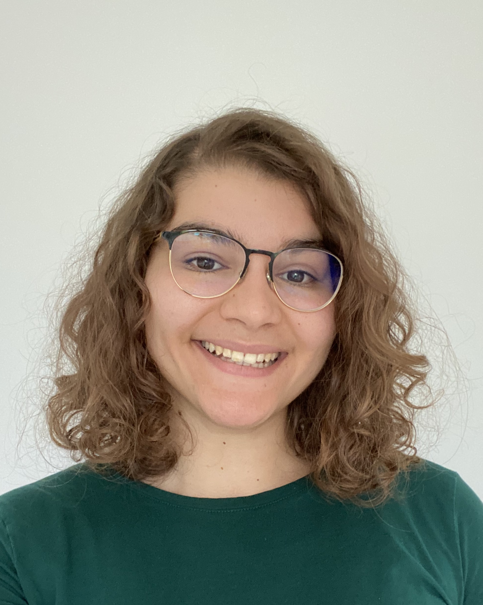
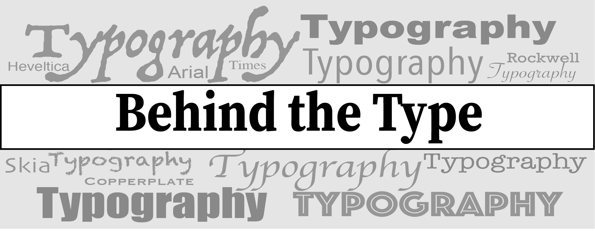
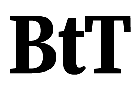

#### About me

My name is Yasmin, and I am a second-year Media, Journalism, Publishing student at Oxford Brookes University. In these three pathways the one that interests me more is Journalism. In fact, I love analysing and reporting, I like understanding how things work, why they are there and how they affect us humans. 

#### About my blog

In this blog I will use my curiosity of understanding how things function to analysing the mechanics behind typography. I will analyse different scenarios in which typography is used to convey ideas, feelings and in most cases, how it is used by brands to build an identity. 

My landing image is a monochromatic composition of different fonts and styles on which I have place a banner with my blog's name on. I know colour is very important in typography but I have chosen to keep it monochromatic as I think it emphasises on the power fonts have on conveying story, emotions and purposes. I used black and white for the actual name of the website to avoid confusion with the writings in the background. The font I used for writing 'Behind the Type' is a bold version of 'Source Serif Variable'. 

The logo is a simple abreviated version of the name 'Behind the Type' composed of the initials 'BtT' in black on a white background for greater contrast, using the same bold version of 'Source Serif Variable'.

