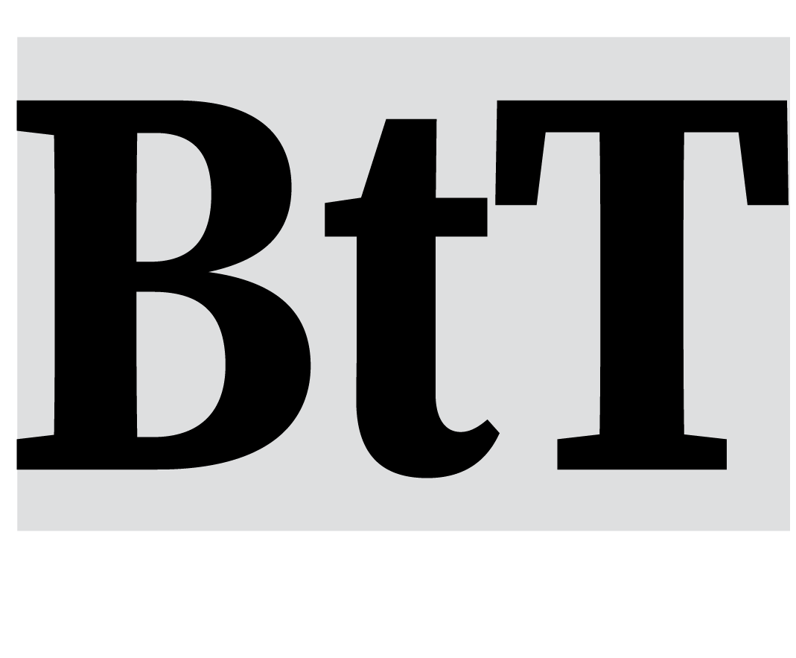

#### About me

My name is Yasmin, and I am a second-year Media, Journalism, Publishing student at Oxford Brookes University. In these three pathways the one that interests me the most is Journalism. In fact, I love analysing and reporting, I like understanding how things work, why they are there and how they affect us humans. 

#### About my blog

In this blog I will use my curiosity of understanding how things function to analysing the mechanics behind typography. Sometimes we do not even realise but typography is everywhere and is used for many purposes. I will analyse different scenarios in which typography is used to convey ideas, feelings and in most cases, how it is used by brands to build an identity. 

#### Banner image

My landing image is a monochromatic composition of different fonts and styles on which I have place a banner with my blog's name. I know colour is very important in typography but I have chosen to keep it monochromatic as I think it emphasises on the power fonts have on conveying story, emotions and purposes. I used black and white for the actual name of the website to avoid confusion with the grey writings in the background. The font I used for writing 'Behind the Type' is a bold version of 'Source Serif Variable'. This font has a slight contrast allowed by the difference in thickness between the horizontal and vertical lines. The serifs give away the feeling of seriousness, less casual, which I am trying to achieve in my blog posts and the brand in general. Serif typfaces also remind me of the first typefaces created from humanistic style, which, I think, is a good choice to represent a website anylising the functionning of typographic.

#### Logo

The logo is a simple abreviated version of the name 'Behind the Type' composed of the initials 'BtT' in black on a light grey background, a variant of the grey I used on the banner image. The middle letter 't' is in lower case to all the emphasis on 'B' for 'Behind' and on 'T' for 'Type'. The font I used is the same bold version of 'Source Serif Variable'. As I do not have a specific theme of analysis for my blog, I am working on typography as a general topic. So this logo allows the feeling of a neutral website that can approach all sorts of themes. 

